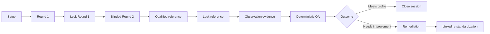
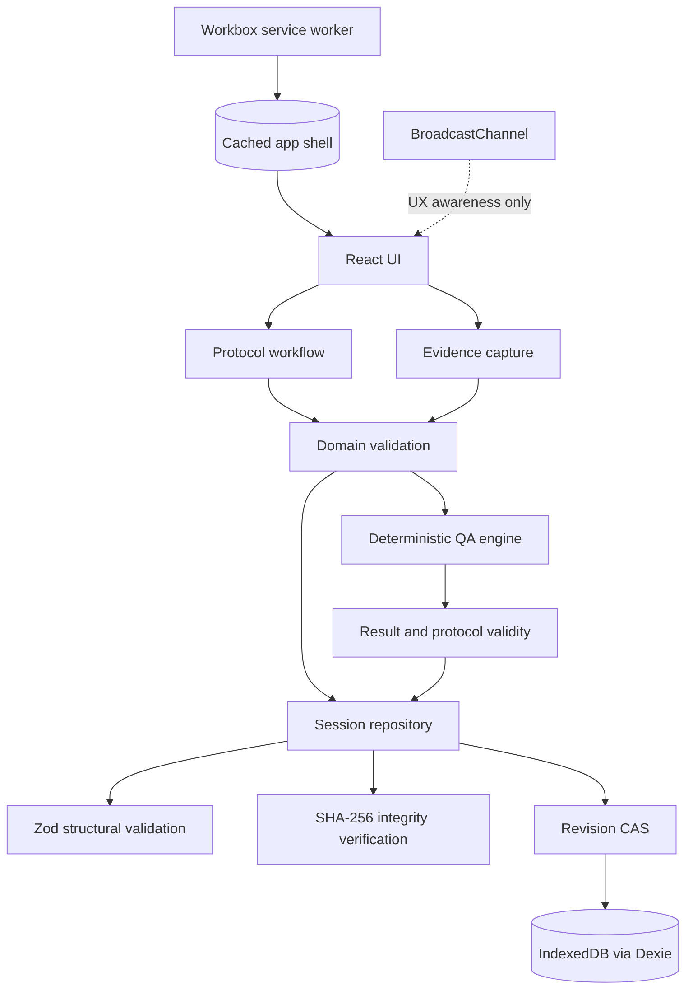
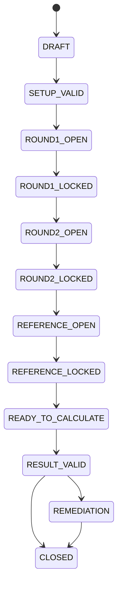

# TumbuhGuard Standardize

**Offline practical anthropometry standardization that validates the measurer, not just the measurement.**

> A measurement can be consistent and still be wrong.

TumbuhGuard Standardize is an offline-first protocol runner for practical length/height anthropometry standardization. It guides a supervisor through blinded repeat measurements, qualified-reference comparison, protocol-validity checks, structured observation evidence, remediation, and linked re-standardization.

- **Protocol-enforced** — sequence, locks, and evidence readiness are domain rules.
- **Deterministic** — the same validated inputs always produce the same result.
- **Offline-first** — after a successful cached load, core assessment work has no network dependency.

## The problem

Digitizing a measurement does not prove that it was performed reliably. A measurer may record nearly identical values twice yet still disagree materially with a qualified reference. They may also be affected by an invalid reference, an incorrect measurement position, or incomplete evidence about the assessment conditions.

That distinction matters:

| Question | What it means |
|---|---|
| **Is the measurer repeatable?** | Do their own paired measurements agree? |
| **Does the measurer agree with a qualified reference?** | Does their measurement align sufficiently with the reference measurement? |

The product problem is therefore not merely recording a value. It is establishing whether that value came from a valid, reviewable assessment workflow.

## The key insight

**Repeatable ≠ correct.**

The deterministic Cadre C scenario makes this concrete:

| Measure | Result |
|---|---:|
| Repeatability TEM | approximately `0.071 cm` |
| Reference-agreement TEM | approximately `0.849 cm` |
| Signed mean difference | approximately `-1.200 cm` |

The trainee is extremely consistent with themselves, yet disagrees sufficiently with the qualified reference to require re-standardization.

> A spreadsheet can calculate a metric. TumbuhGuard controls whether that metric came from a valid assessment workflow.

## What TumbuhGuard does

TumbuhGuard coordinates the complete practical standardization process:

1. Configure the session and station context.
2. Record and lock the first measurement round.
3. Record a blinded second round without exposing first-round values in the normal entry interface.
4. Record and validate qualified-reference measurements.
5. Capture required observation evidence before calculation.
6. Evaluate repeatability, agreement, directional difference, and protocol validity deterministically.
7. Preserve evidence for review, then close or remediate the assessment.
8. Create a clean, linked re-standardization session when improvement is required.



### Blinded second-round entry

Round-1 values are not exposed in the normal Round-2 entry workflow. This is workflow-level blinding: it prevents accidental influence through the standard interface, while making no cryptographic-secrecy claim about an unrestricted local device owner.

## Why this is more than a calculator

| Capability | Simple calculator | TumbuhGuard |
|---|---:|---:|
| TEM calculation | ✓ | ✓ |
| Guided protocol sequence | — | ✓ |
| Locked measurement rounds | — | ✓ |
| Blinded Round 2 entry | — | ✓ |
| Qualified-reference validity | — | ✓ |
| Observation evidence | — | ✓ |
| Protocol-position validity | — | ✓ |
| Stale-write protection | — | ✓ |
| Linked re-standardization | — | ✓ |
| Offline local workflow | depends | ✓ |

The application preserves the evidence needed to interpret an assessment without pretending to assign causal blame. A position deviation, for example, remains visible as evidence and withholds the normal verdict; it is not silently corrected.

## Architecture



The browser UI requests actions; the domain layer decides whether they are legal. Persistence validates stored records, checks integrity, and commits only against the expected revision. BroadcastChannel can make another tab aware of a change, but it is not the correctness mechanism: revision compare-and-swap is.

## Protocol state machine



Illegal transitions are rejected: Round 2 cannot start before Round 1 is locked, locked rounds cannot be edited, and calculation cannot begin until required reference and observation evidence are complete. Re-standardization creates a distinct linked session in `DRAFT`; it never reopens the historical parent.

## Engineering principles

### Deterministic by design

No AI or probabilistic inference determines an assessment result. Validated inputs, protocol profile, and calculation version produce a deterministic result.

### State-machine enforced

Workflow correctness is a domain rule rather than a UI convention. The interface reflects state; it cannot make an illegal transition valid.

### Raw values decide

Threshold classification is based on raw calculation values, never rounded display values. An exact threshold value does not pass under the working profile's strict comparisons.

### CAS concurrency

Every persistence write carries an expected revision:

```text
expected revision == persisted revision  → commit revision N + 1
expected revision != persisted revision  → STALE_REVISION
```

This prevents a stale tab from overwriting a newer session or recreating a session that another tab reset. The workflow also permits only one active assessment head at a time.

### Local-first, offline-first

Assessment state lives in IndexedDB. Vite, `vite-plugin-pwa`, and Workbox provide the cached shell; after it has loaded successfully once, the core workflow, calculation, evidence review, and re-standardization operate without a required remote service.

Service-worker updates are deferred during active protocol states. `navigator.storage.persist()` is opportunistic: denial or absence does not prevent the application from functioning.

## Scientific method

For paired measurements, TumbuhGuard computes:

```text
d_i = x_i1 - x_i2

TEM = sqrt(sum(d_i²) / (2N))
```

Pairs are matched by subject identity. Duplicate, malformed, incomplete, and out-of-range measurement inputs are rejected before evaluation.

| Check | Working threshold |
|---|---:|
| Trainee repeatability TEM | `< 0.6 cm` |
| Trainee/reference agreement TEM | `< 0.8 cm` |
| Reference repeatability TEM | `< 0.4 cm` |

The application distinguishes:

- **Trainee repeatability:** consistency across the trainee's paired rounds.
- **Reference repeatability:** whether the qualified reference is itself sufficiently repeatable.
- **Trainee/reference agreement:** the magnitude of disagreement with the reference.
- **Signed mean difference:** directional descriptive evidence, not a substitute for TEM.

Signed differences can cancel: positive and negative errors may average near zero while disagreement remains large. If reference repeatability is invalid, normal reference-agreement assessment is withheld. If protocol validity fails, evidence is retained but the normal verdict is withheld.

## Evidence and integrity

Each session preserves measurement rounds, expected and actual position, station/device context, observations, protocol snapshot, and result evidence. Persisted session structures are validated with Zod; result integrity is checked from source measurements rather than trusting stored derived values alone. SHA-256 integrity checks and revision history provide application-level protection against accidental inconsistency and stale local writes.

This is not a claim of tamper-proof storage. A user who controls a local browser profile is outside the application's workflow-level threat model.

## Privacy by scope

The current prototype uses synthetic subjects only. It requires no NIK, real child names, photos, addresses, phone numbers, medical-record identifiers, cloud accounts, or remote API.

Exports retain their synthetic boundary:

```text
dataMode: SYNTHETIC
synthetic: true
```

## Demonstration flow

The Home screen offers **Run 90-sec Demo**, which loads the deterministic Cadre C case at the final blinded Round-2 entry. The legal workflow is:

1. Enter the final Round-2 value for S10 (`95.9 cm`) and lock Round 2.
2. Open qualified-reference measurements and load the synthetic reference fixture.
3. Lock the reference measurements.
4. Record each required observation item.
5. Select **Lock evidence & prepare calculation**.
6. Select **Calculate deterministic QA result**.
7. Review measurements, observation, equipment, and protocol evidence; then create linked re-standardization if required.

The expected Cadre C result shows strong self-repeatability alongside insufficient reference agreement, making the distinction between consistency and correctness visible.

## Technology stack

| Layer | Technology |
|---|---|
| UI | React 19, TypeScript |
| Build | Vite 7 |
| Persistence | Dexie 4, IndexedDB |
| Validation | Zod 4 |
| Offline | `vite-plugin-pwa`, Workbox |
| Integrity | Web Crypto SHA-256 |
| Concurrency | Revision CAS; BroadcastChannel UX awareness |
| Unit testing | Vitest 4 |
| Browser testing | Playwright 1.63 |

## Testing and verification

Verification coverage includes deterministic calculation boundaries, state-machine legality, Round-2 blinding, malformed persistence records, CAS conflicts, concurrent tabs, synthetic-data claim guards, fixture regression, offline/PWA behavior, accessibility, and responsive interaction.

The primary local commands are:

```bash
npm run check
npm run release:verify
```

Release evidence is maintained separately from this overview in [release-v1.0.2.md](docs/release-v1.0.2.md). Scientific claims and their boundaries are documented in [claims-matrix.md](docs/claims-matrix.md) and [protocol-sources.md](docs/protocol-sources.md).

## Repository structure

```text
src/
  app/          application workflow and update policy
  domain/       protocol rules, calculations, evidence, and session transitions
  data/         validation, hashing, export, and IndexedDB repositories
  features/     workflow UI panels
  fixtures/     deterministic synthetic scenarios

tests/
  unit/         calculation and input boundaries
  domain/       protocol and state rules
  persistence/  integrity, schema, and CAS behavior
  fixtures/     scenario regression
  claims/       privacy and claim guards

e2e/            browser, offline, concurrency, accessibility, and responsive flows
docs/           claims, source boundary, and release evidence
scripts/        build, fixture, smoke, lint, and release checks
```

## Run locally

Requires Node.js 24.

```bash
npm ci
npm run dev
```

For the core verification suite:

```bash
npm run check
```

For the complete release verification, including browser checks:

```bash
npm run release:verify
```

## Scientific scope and limitations

TumbuhGuard implements a practical anthropometry standardization workflow using a working profile informed by established anthropometry-standardization concepts.

- It is not an official certification system.
- It does not diagnose stunting or any health condition.
- It is limited to the current length/height workflow and synthetic subjects.
- Official deployment would require programme, security, privacy, and operational validation.
- Exact external Annex-13/DHS oracle parity remains pending: `EXTERNAL_ORACLE_PARITY_PENDING`.

The project deliberately does not claim certification by WHO, Kemenkes, or any other authority, and it does not present its working thresholds or UI sequence as an official workflow.

## Future work

Future work should begin with independent external-oracle validation, programme validation, and deployment-specific security and privacy design. Those activities are intentionally outside the current local, synthetic-data scope.
